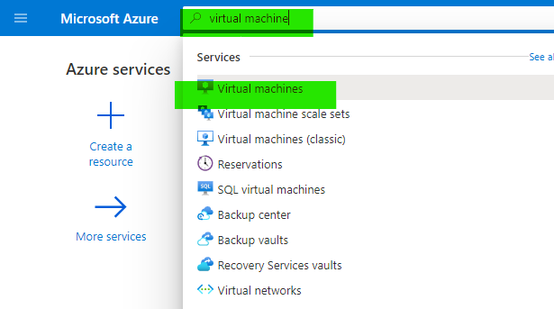
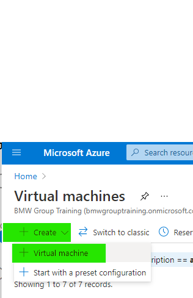
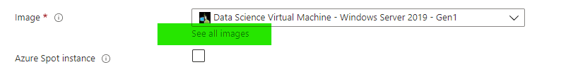
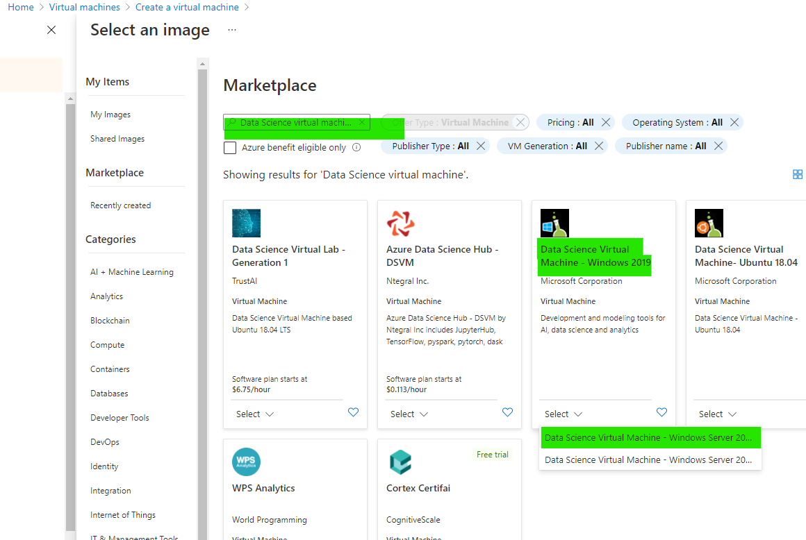
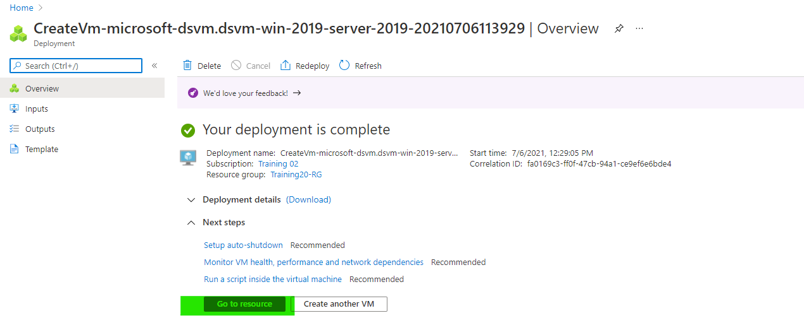
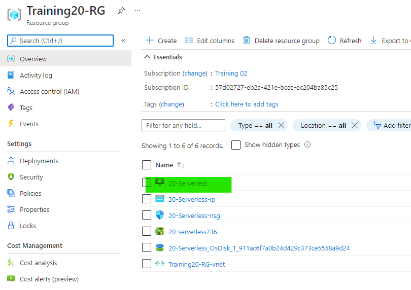
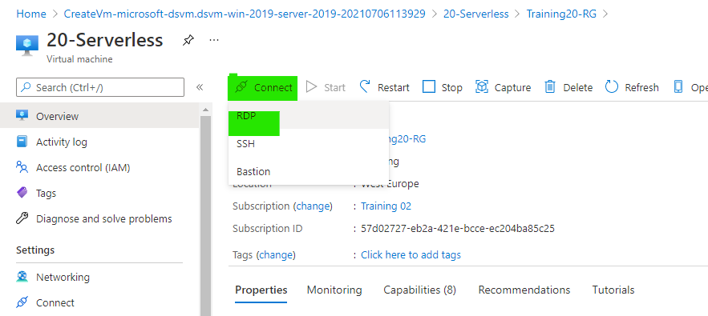
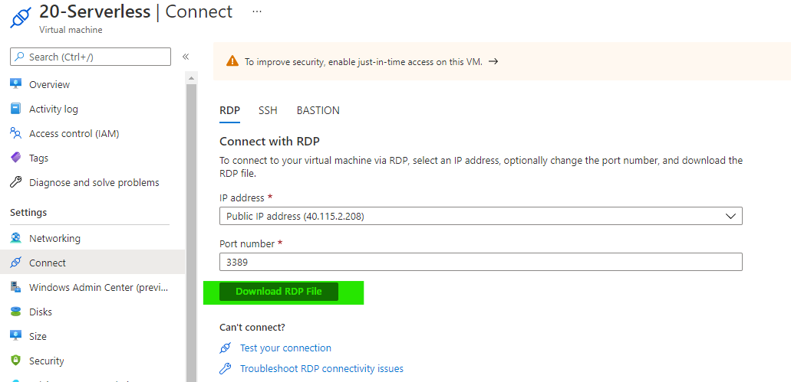
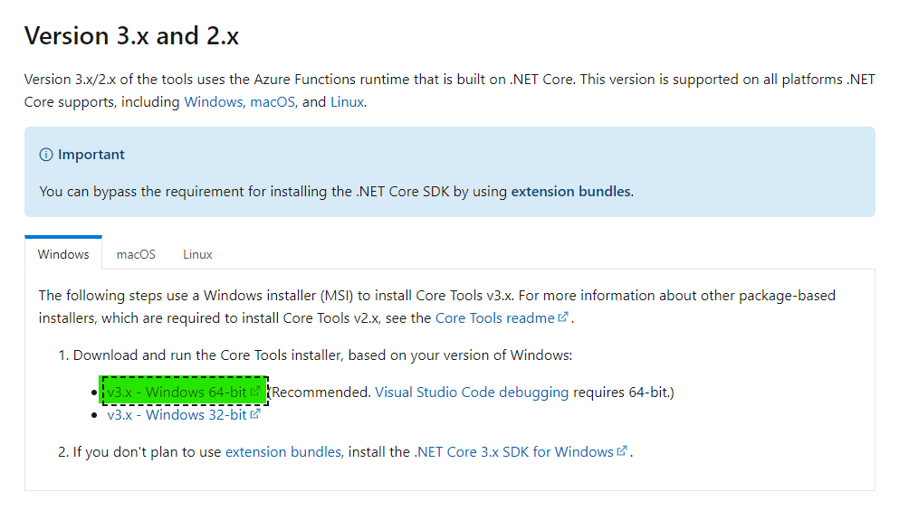
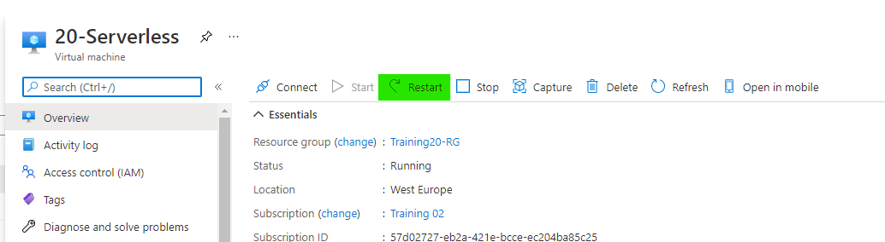

# Challenge 0: Setup your System

⏲️ *Est. time to complete: 45 min.* ⏲️

## Here is what you will learn 🎯

To be able to follow all the challenges provided in this workshop, you need a few prerequisites on your machine. This challenge is for setting up your system. It covers creating a virtual machine in Azure and configuring the require prereqs for the lab

## Table Of Contents

1. [Create Serverless Lab Virtual Machine](#create-serverless-virtual-machine)
2. [Azure CLI](#azure-cli)
3. [Install Azure functions Runtime](#install-azure-functions-runtime)
4. [Visual Studio Code](#visual-studio-code)
5. [Reboot VM](#reboot-vm)

## Virtual Machine

## Create Serverless Virtual Machine

- Search for virtual machines in the portal
- 
- and hit the '+' symbol to add a VM:
- 
- Create the VM according to the table:  

| Name     |  Values     |                                                |
|-----|-----|-----|
| _Resource group_ |  `#use assigned RG s`|
| _Virtual machine name_ | `#Number-Serverless`|
| _Region_ | West  Europe |
| _Availability options_ | No infrastructure redundancy required   |
| _Image_ | Data Science Virtual MAchine - Windows Server 2019 - Gen1 |
| _Size_ | DS3_v2 -4vcpu, 14GB memory|
|_Username_|  **not** 'Admin' **nor** 'Administrator' **nor** 'root' |
|_Password_ | %complex enough% |

- You need to use a vm based  a data science virtual machine  image. This is image has all dependencies pre-installed and requires the least amount of setup. to do this you need to search for the image by Clicking "see all images"

- Then search for the string "Data science Virtual machine". Find the the image called "Data Science Virtual MAchine - Windows 2019". Select the Gen1 version
!important: Do not select Gen2

- Click Review and Create. The configuration is then validated. Once validated click Create
- On successfuly creation you will see the following result page

- Naviagte to the Resource group and you will see the following set of resources that were create. Click the Virtual machine

- To login into virtual machine click "Connect" and select RDP

- Download the RDP file and open it. You will be challenged for a user name and password that was set on in the creation step


::: tip📝 Helpful Reference: Azure naming conventions:

- [Define your naming convention](https://docs.microsoft.com/en-us/azure/cloud-adoption-framework/ready/azure-best-practices/resource-naming)  
- [Recommended abbreviations for Azure resource types](https://docs.microsoft.com/en-us/azure/cloud-adoption-framework/ready/azure-best-practices/resource-abbreviations)

:::

## Install Serverless Lab prereq

## Azure CLI

We will also be using the Azure command-line interface to create and interact with resources running in Azure. To install it, go to <https://docs.microsoft.com/en-us/cli/azure/install-azure-cli?view=azure-cli-latest> and choose your platform.

When finished, login to your Azure account from the command-line:

```shell
$ az login
You have logged in. Now let us find all the subscriptions to which you have access...
```

A browser window will open, login to Azure and go back to the command prompt. Your active subscription will be shown as JSON, e.g.:

```json
{
  "cloudName": "AzureCloud",
  "id": "xxxxxxxx-xxxx-xxxx-xxxx-xxxxxxxxxxxx",
  "isDefault": false,
  "name": "Your Subscription Name",
  "state": "Enabled",
  "tenantId": "xxxxxxxx-xxxx-xxxx-xxxx-xxxxxxxxxxxx",
  "user": {
    "name": "xxx@example.com",
    "type": "user"
  }
}
```

:::tip
📝If you have multiple subscriptions, make sure you are working with the correct one!
:::

```shell
$ az account show
{
  "cloudName": "AzureCloud",
  "id": "xxxxxxxx-xxxx-xxxx-xxxx-xxxxxxxxxxxx",
  "isDefault": false,
  "name": "Your Subscription Name",
  "state": "Enabled",
  "tenantId": "xxxxxxxx-xxxx-xxxx-xxxx-xxxxxxxxxxxx",
  "user": {
    "name": "xxx@example.com",
    "type": "user"
  }
}
```

If the displayed subscription is not the correct one, follow the steps below:

```shell
$ az account list -o table
[the list of available subscriptions is printed]

$ az account set -s <SUBSCRIPTIONID_YOU_WANT_TO_USE>
```

## Install Azure functions Runtime

For this lab we require azure functions runtime. 

- Download the Azure functions binary and install. 
- <https://docs.microsoft.com/en-us/azure/azure-functions/functions-run-local?tabs=windows%2Ccsharp%2Cbash#v2>


## Visual Studio Code

Visual Studop Code is already installed on the machine. Simply start "Visual Studio Code"

### Useful Extensions

Once Visual Studio Code is opened and select the "Extensions" sidebar:


Search and install the following extensions: Click the below links and follow install instructions

- Azure Tools <https://marketplace.visualstudio.com/items?itemName=ms-vscode.vscode-node-azure-pack>
- C# <https://marketplace.visualstudio.com/items?itemName=ms-vscode.csharp>
- Azure Functions <https://marketplace.visualstudio.com/items?itemName=ms-azuretools.vscode-azurefunctions>
:::tip
📝 The _Azure Functions_ extension should have already been installed as part of the _Azure Tools_ extension, but you additionally need to make sure to follow the OS-specific instructions.
:::

## Reboot VM

After the functions runtime and the Azure extensions are install please reboot the virtual machine. This should be done in the Azure portal

- Naviagte to the Resource group and you will see the following set of resources that were create. Click the Virtual machine

- Select the Restart button

- The machine takes around 1-2 minutes to restart. After that download the RDP file and reconnect.


 [🔼 Day 1](../README.md) | [Next challenge ▶](../challenge-03/README.md)
