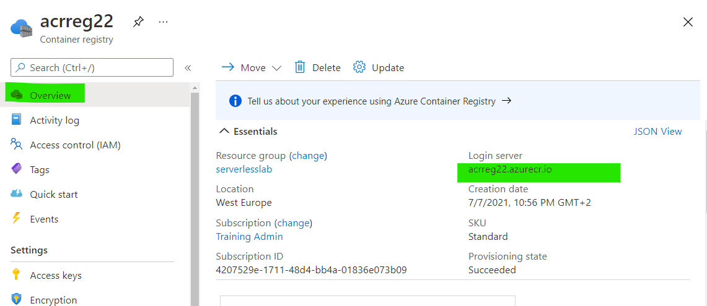

# Challenge 5: Azure Container Services

## Here is what you'll learn

- Creating Azure Container Registry Instance
- Pushing images that we have built to ACR
- Creating first AKS cluster and deploying phpapp application

In this challenge, we're gonna create our ACR and AKS instances and deploy a php based webapp that we have containerized at the end of challenge 4.

## Exercises

**1: Azure Container Registry**
<details>
  <summary>Click to expand!</summary>

In this first task, we'll create a new Azure Container Registry (ACR) Instance. Azure Container Registry allows us to build, store, and manage container images and artifacts in a private registry for all types of container deployments. We're gonna store 2 images that we've created at the end of the challenge 4. Let's get started. We'll complete this via portal, so let's jump to <https://portal.azure.com>

- Click the hamburger icon on the top left of the screen.
- Click **Create a resource** link.


- Click **Container** on the left menu.
- Continue with **Container Registry** option


- Now we're on the **Create container registry** screen.
- Select a subscription. Click **Create New** button once the Resource Group and create a new resource group.
- Fill the other values.
  - Registry Name: Type a unique name.
  - Location: Select **West Europe**.
  - SKU: Keep as is. **Standard**
- Click **Review + create**.


- Click **Create** and finalize the ACR creation steps.


- When done, click **Go to resource** button and access newly created ACR instance.


- Now it's time to get connection details of our ACR instance.
- Click **Access keys** on the left.
- Click **Enable** under the **Adminuser** section and enable Adminuser.
- Copy the **Login Server**, **Username** and **Password** values into a text editor. We'll use these later.  


  - - It's time log into our newly created ACR instance.

```shell
az acr login -n $registryName 
```

Output will be something like:

```shell
$az acr login -n acrreg22
Login Succeeded

```


- We could successfully logged in. This means that from now on we can push images to this registry. For this lab we will not be pushing local images to the registry due to limitations in the virtual machine. Instead we are going to build images

</details>

***
**2: Build Docker images in ACR**
<details>
  <summary>Click to expand!</summary>

In this second task, we are going to store push 2 application images in the newly create image registry. We are going to use ACR to build our images instead of building locally. The application source code is under the folder ``trainingdays/day6/apps/php``
Note: we are not building locally due to limitations in the VM when running docker operations.

Type:

```shell
cd trainingdays/day6/apps/php
```

- we are going to build two image based on the dockerfile found under the php folder ``Dockerfile`` and ``Dockerfile.mssql``


- To build the PHP application type the following into the command line. This command will push the source code to ACR and and ACR will automatically build this for you  

Output will be something like:

```shell
az acr build --image  php:v1 --registry $registryname --file Dockerfile .
```

- The start of the build process should look like this


- While on succesful completion the output should look something like this


- We can now verify if our image has being built and pushed to our registry  by navigating to our registry and click ``repositories``  to view the uploaded image


- Alternatively we could see the list of images using the command line ``repositories``
 

- To build the second image, mysqldb, we basically perform the same operation but point to a different Dockerfile
- Execute the following command under the same path ``trainingdays/day6/apps/php``

```shell
az acr build --image  mysql:v1 --registry $registryname --file Dockerfile.mysql .
```

- Confirm  the image was built and pushed succesfully by performing a list in the command line or using the portal
 

- There should be 2 images that we have created at the end of the challenge this section. They were tagged as $registryname.azurecr.io/mysql:v1 and $registryname.azurecr.io/mysql:v1.
- We successfully built  our images and pushed them to newly created ACR. Image part has been completed.

</details>

***
**3: Azure Kubernetes Service**
<details>
  <summary>Click to expand!</summary>

It's time to create our first AKS cluster.  

- On the portal, find your Resource Group and on the overview screen click **Add**.


- Under the the **Containers** click **Kubernetes Service**.


- Select your subscription.
- Fill the other values.
  - Kubernetes cluster name: Type a unique name.
  - Region: Select **West Europe**.
  - Kubernetes version: Leave as is.

- Click **Integrations**.


- Select the ACR instance that we created a few minutes ago.
- Click **Review + create**.


- Click **Create** and wait until it has been successfully created.
  


- Congrats. You have successfully built your first AKS cluster.

</details>

***
**4: Deploy php app to AKS**
<details>
  <summary>Click to expand!</summary>

Now it's time to deploy our php app to AKS cluster.

- We're gonna use ```kubectl``` tool to manage Kubernetes cluster. Kubernetes command-line tool, kubectl, allows us to run commands against Kubernetes clusters. We can use kubectl to deploy applications, inspect and manage cluster resources, and view logs.
- To install ```kubectl``` you can simply execute the following install command.

```shell
choco install kubernetes-cli -y
```

- When you interact with an AKS cluster using the kubectl tool, a configuration file is used that defines cluster connection information. This configuration file is typically stored in ~/.kube/config.

- You can use Azure cli to download this crdential file from the server.

```shell
az aks get-credentials -n $AKS_NAME -g $RESOURCE_GROUP
```

- This command lets you get access to the credentials for an AKS cluster and merges them into the kubeconfig file under ``~/.kube/config``.  Thus we can manage our Kubernetes cluster.

Type:

```shell
az aks get-credentials --resource-group resource_group_name --name aks_cluster_name
```

Output will be something like:

```shell
The behavior of this command has been altered by the following extension: aks-preview
Merged "aks_cluster_name" as current context in /home/username/.kube/config
```

- We have merge the config. It's time to check if kubectl works properly. Let's list all the nodes in the cluster.

Type:

```shell
kubectl get nodes
```

Output will be something like:

```shell
NAME                                STATUS   ROLES   AGE   VERSION
aks-agentpool-10704589-vmss000000   Ready    agent   26m   v1.16.13
aks-agentpool-10704589-vmss000001   Ready    agent   26m   v1.16.13
aks-agentpool-10704589-vmss000002   Ready    agent   26m   v1.16.13
```

- It seems that our cluster is ready. Let's deploy our app.


- Note: it is also possible to follow the instructions in the Azrue portal on how to connect. These instructions can be found under the AKS overview page.


- There are 2 ways to spin up Kubernetes resources. Imperative method, which is basically using command line. But there’s an easier and more useful way to do, declarative method, creating configuration files using YAML. Most of the things you can deploy to a Cluster in Kubernetes can be described as a YAML file. YAML is a human-readable text-based format that let’s us easily specify configuration-type information by using a combination of maps of name-value pairs and lists of items.
- We have created a yaml file to create 2 deployment and 2 service objects. All the config that is needed to create these objects are defined in this yaml file. But what is a deployment, what is a service? These are the object types that you can create on Kubernetes. Simply, deployment object is our application and service object is an end-point that exposes this application to other services or external users. But all of these are Kubernetes related topics and we won't cover them today. We have a full Kubernetes day, Day 7, there you will get all the information related to Kubernetes. Today, we're gonna only deploy this application and that's all.

- So first let's open the yaml file. Go to ```day6/apps/kube``` folder and open ```app.yaml``` on a text editor.
- There are 2 lines that you have to update here. Go to line 19 and 66 and update the ACR url with your own.

```
19-->image: day6demo.azurecr.io/mysql:v1
66-->image: day6demo.azurecr.io/php:v1
```

- the content should look like the following


- It's finally time to deploy our application. The app.yaml file can be found under ``day6/apps/kube``

Type:

```shell
kubectl apply -f app.yaml # or app.deploy based on your filename. 
```

Output will be something like:

```shell
deployment.apps/mysqldb created
service/mysqldb created
deployment.apps/phpapp created
service/phpapp created
```

- 2 deployments and 2 services have been created. Let's check if pods are running or not.

Type:

```shell
kubectl get pods 
```

Output will be something like:

```shell
NAME                                                       READY   STATUS    RESTARTS   AGE
mysqldb-df67cc945-ctfqg                            1/1     Running   0                  1m
phpapp-df67cc945-s5z6n                             1/1     Running   0                  1m
```

- Type couple of times ```kubectl get pods``` till the statuses turn ```Running```.


- Congratulations! We could successfully deploy our application to AKS cluster. Let's access it and see if it works properly. To be able to do that we have to get external ip address of the phpapp service.

Type:

```shell
kubectl get svc
```

Output will be something like:

```shell
NAME                                       TYPE           CLUSTER-IP     EXTERNAL-IP      PORT(S)    AGE
mysqldb                                    ClusterIP      10.0.250.27    <none>           80/TCP     48d
phpapp                                     LoadBalancer   10.0.243.220   51.145.177.190   80/TCP     47d
kubernetes                                 ClusterIP      10.0.0.1       <none>           443/TCP    59d
```

- Copy the external ip address of the phpapp service.


- Open a web browser and visit the site published via the copied ip address.
- Fill the form and add a new record. If you get **Successfully created**  message when you click add, this means that everything works perfectly.


</details>

***
**5: (Bonus): Azrue Container Instances**
<details>
  <summary>Click to expand!</summary>

In this section we are simply going to deploy our built images to Azure Container instances. Azure container instances is 100% serverless technology to run containers in the cloud.
 In this task we are simply need to update a yaml file to reference our built images in our Azure Container Registry. We will need to add the credentials too  

1. Navigate to the path ``trainingdays/day6/apps/aci`` and open the file ``aci.deployment.yaml``
2. Update the registry URL, line 6  in the file deployment file
 

3. the URL can be found in the ACR overview


4. update registry credenitals line 7 and 8 : the credentials can be found under access Key in the ACR view.


5. Now we need to update our image references in the file ``aci.deployment.yaml``. We need to update the yaml file to user our custom ACR.  Update line ``12`` and ``33`` with the same vaule from step 2


6. Now we are ready to deploy using ACI. Simply deploy using the following command: keep in mind you need specific your resource group.

- ``az container create --resource-group $RESOURCE_GROUP --file aci.deployment.yaml``

7. Verify succesful deployment by Navigating to your your resource group. Find the ACI resource called "myphpapp".
8. Under containers menu item, you should see both containers deployed should have the status ``running``


9. You can now open the application by navigating to "overview" and selecting opening the IP address
10. You should see the following webpage if it was succesfully deployed


</details>

***

## Wrap up

__Congratulations__ you have completed the Azure Container Services challenge. You have created your first ACR instance and AKS cluster and deploy an application.

***
**4: Clean-up**

When you complete the challenge, please don't forget to delete the resources that you have created. Via the portal, find the resource group that you have created at the beginning of this challenge and delete it. All the resources **ACR, AKS** that you have created in this resource group will be automatically deleted too.


*** Reference: <https://docs.microsoft.com/en-us/azure/aks/> <https://docs.microsoft.com/en-us/azure/container-registry/> <https://docs.microsoft.com/en-us/azure/container-registry/>
